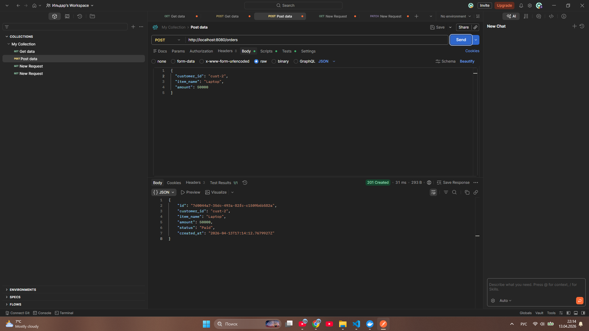
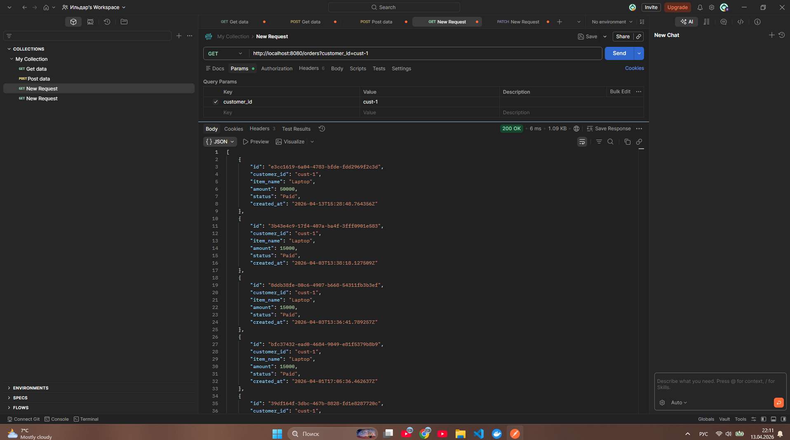
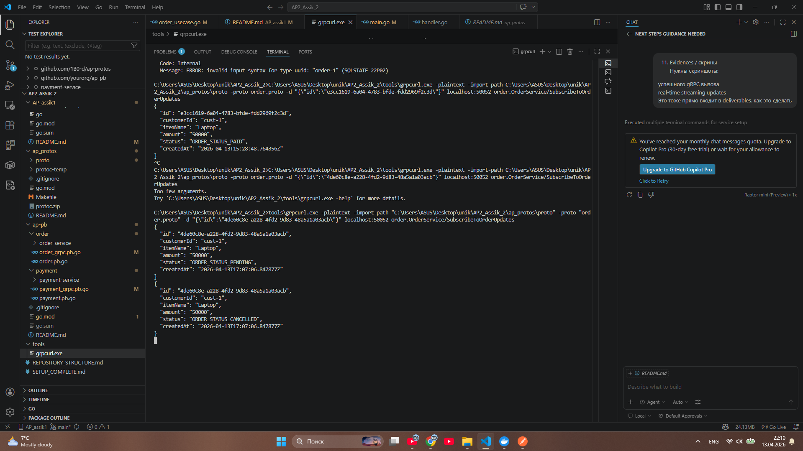
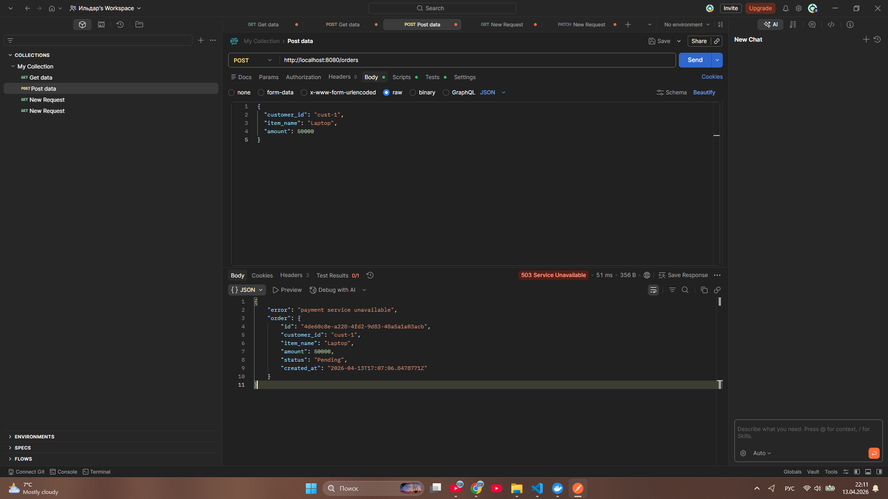

# AP2 Assignment 1 — Order & Payment Microservices with gRPC

## Overview

This project implements two Go microservices:

- `order-service`
- `payment-service`

The services follow **Clean Architecture** principles and are separated by bounded contexts.
Each service owns its own data and database.
The internal service-to-service communication is implemented using **gRPC** and Protocol Buffers.
External clients can still use HTTP endpoints exposed by both services.

---

## What Changed

This project was migrated from HTTP-based inter-service communication to gRPC.

### Before the migration
- `order-service` called `payment-service` over HTTP
- the communication used manual JSON serialization and HTTP requests
- the internal service call was synchronous REST

### After the migration
- protobuf contracts were added to `ap_protos/proto/`
- generated Go code was placed in `ap-pb/`
- `payment-service` now exposes a gRPC server with `ProcessPayment`
- `order-service` now uses a gRPC client to call `payment-service`
- `order-service` also exposes its own gRPC server with streaming support for order updates
- documentation and architecture diagrams were updated accordingly

---

## Service Responsibilities

### Order Service
Responsible for:

- creating orders
- storing orders in its own database
- calling `payment-service` to process payments
- updating order status based on payment result
- returning order details to clients
- cancelling only pending orders

HTTP endpoints:

- `POST /orders`
- `GET /orders/{id}`
- `PATCH /orders/{id}/cancel`

### Payment Service
Responsible for:

- processing payment requests
- applying payment rules
- storing payment records in its own database
- returning payment status for a specific order

HTTP endpoints:

- `POST /payments`
- `GET /payments/{order_id}`

---

## How It Works Now

### External Client
External clients interact with `order-service` over HTTP.

### Internal Communication
`order-service` calls `payment-service` using gRPC instead of HTTP.

Order flow:

1. Client sends `POST /orders` to `order-service`
2. `order-service` creates a new order with status `Pending`
3. `order-service` calls `payment-service` via gRPC `ProcessPayment`
4. `payment-service` processes the payment and returns a result
5. `order-service` updates the order status:
   - `Paid` if payment is authorized
   - `Failed` if payment is declined
   - `Pending` if payment service is unavailable

### gRPC Ports

- `payment-service` gRPC port: `50051` (configurable with `PAYMENT_GRPC_ADDR` and `PAYMENT_GRPC_PORT`)
- `order-service` gRPC port: `50052` (configurable with `ORDER_GRPC_PORT`)

---

## Protobuf and Generated Code

- `.proto` files are stored in `ap_protos/proto/`
- generated Go code is stored in `ap-pb/`
- both services use a local `replace` directive in `go.mod`:
  `replace github.com/1B0-d/ap-pb => ../../ap-pb`

## Repository Links

- `proto` repository: `https://github.com/1B0-d/protos`
- `generated` repository: `https://github.com/1B0-d/ap-pb`

> Replace the URLs above with the actual GitHub repository addresses for your proto definitions and generated Go package.

## Proto Generation

- Run local generation inside `ap_protos/` with `make generate` or `protoc` if available.
- Generated code is committed into `ap-pb/` so services can import it locally.
- For the best score, add a GitHub Actions workflow that runs `protoc` remotely and updates `ap-pb/` automatically.

---

## Clean Architecture Layers

Each service follows a layered structure:

- `domain` — entities, interfaces, and status constants
- `usecase` — business logic and state transitions
- `repository` — persistence and outbound gRPC client implementation
- `transport/http` — HTTP handlers and routes
- `transport/grpc` — gRPC server implementations
- `cmd/.../main.go` — composition root and dependency wiring

This structure keeps business rules separate from transport details.

---

## Internal Flow

```
Client HTTP -> Order Service HTTP -> Order Use Case
    -> Order Repository -> Order DB
    -> Payment gRPC Client -> Payment Service gRPC -> Payment Use Case -> Payment DB
```

---

## Domain Models

### Order
- `ID`
- `CustomerID`
- `ItemName`
- `Amount int64`
- `Status`
- `CreatedAt`

Order statuses:
- `Pending`
- `Paid`
- `Failed`
- `Cancelled`

### Payment
- `ID`
- `OrderID`
- `TransactionID`
- `Amount int64`
- `Status`

Payment statuses:
- `Authorized`
- `Declined`

---

## Business Rules

### Order rules
- amount must be greater than `0`
- only `Pending` orders can be cancelled
- `Paid` orders cannot be cancelled

### Payment rules
- `amount > 100000` results in `Declined`
- otherwise the payment becomes `Authorized`

### Failure handling
- if the gRPC call to `payment-service` fails, the order stays `Pending`
- `order-service` returns `503 Service Unavailable`

---

## Project Structure

```
order-service/
├── cmd/order-service/main.go
├── internal/
│   ├── domain/
│   ├── usecase/
│   ├── repository/
│   ├── transport/grpc/
│   └── transport/http/
├── migrations/
└── go.mod

payment-service/
├── cmd/payment-service/main.go
├── internal/
│   ├── domain/
│   ├── usecase/
│   ├── repository/
│   ├── transport/grpc/
   └── transport/http/
├── migrations/
└── go.mod

ap_protos/
├── proto/order.proto
├── proto/payment.proto
└── Makefile

ap-pb/
├── order/
├── payment/
└── go.mod
```

---

## Migration Summary

### Main changes

- replaced `PaymentHTTPClient` with `PaymentGRPCClient`
- added gRPC server implementations in both services
- added protobuf contracts and generated code
- updated service wiring in `main.go`

### Why gRPC

- contracts are defined in `.proto` files
- no manual JSON serialization for service-to-service calls
- internal calls are strongly typed
- easier to maintain and extend

---

## Running the Services

1. Start the databases:

```bash
cd AP_assik1
docker compose up -d
```

2. Apply SQL migrations for both services.

3. Run `payment-service`:

```bash
cd AP_assik1/payment-service
go run ./cmd/payment-service
```

4. Run `order-service`:

```bash
cd AP_assik1/order-service
go run ./cmd/order-service
```

---

## API Examples

### HTTP examples

Create an order:

```bash
curl -X POST http://localhost:8080/orders \
  -H "Content-Type: application/json" \
  -d '{"customer_id":"cust-1","item_name":"Laptop","amount":15000}'
```

Get order:

```bash
curl http://localhost:8080/orders/{id}
```

Cancel pending order:

```bash
curl -X PATCH http://localhost:8080/orders/{id}/cancel
```

### gRPC examples

Create an order via gRPC:

```bash
grpcurl -plaintext localhost:50052 order.OrderService/CreateOrder \
  -d '{"customer_id":"cust-1","item_name":"Laptop","amount":15000}'
```

Call payment-service directly:

```bash
grpcurl -plaintext localhost:50051 payment.PaymentService/ProcessPayment \
  -d '{"order_id":"order-1","amount":15000}'
```

---
## Evidence / Screenshots

### 1. Successful order creation
This screenshot shows a successful `POST /orders` request.  
The order is created and returned with status `Paid`, which confirms that `order-service` successfully communicated with `payment-service` via gRPC.




### 2. Get orders by customer
This screenshot shows the `GET /orders?customer_id=...` endpoint returning all orders for a given customer.



### 3. Real-time gRPC streaming updates
This screenshot shows the `SubscribeToOrderUpdates` gRPC streaming call.  
The same order is first received with status `PENDING` and then updated to `CANCELLED`, which demonstrates real-time server-side streaming.



### 4. Payment service unavailable handling
This screenshot shows the case when `payment-service` is unavailable.  
`order-service` returns `503 Service Unavailable`, and the order remains in `Pending` state.



---
## What is complete

- internal communication migrated from HTTP to gRPC
- HTTP APIs remain available for external clients
- protobuf contracts and generated code are present
- order-service calls payment-service through gRPC
- payment-service serves gRPC requests
- documentation reflects the new architecture

---

## Delivered

- source code for both services
- SQL migrations
- protobuf contracts
- generated gRPC code
- updated README
