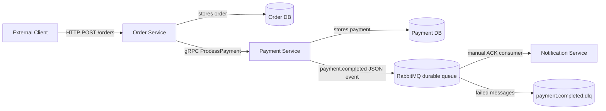
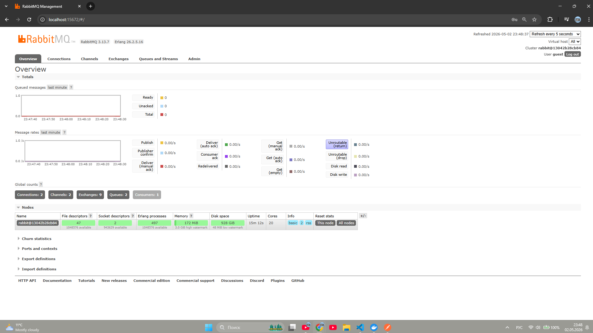
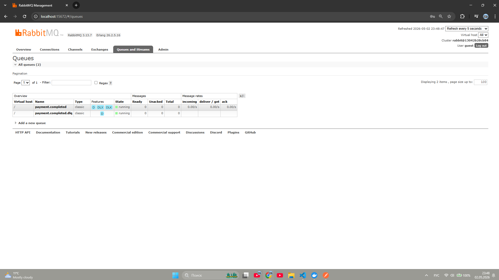
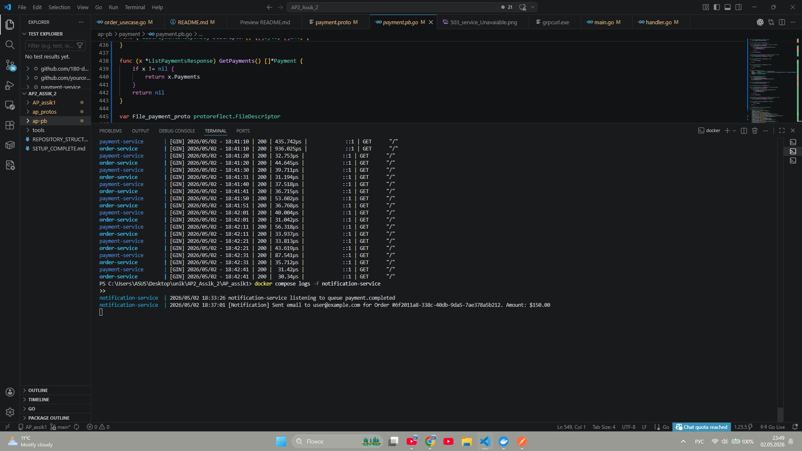
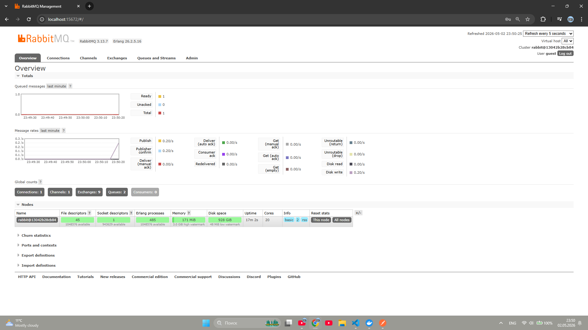
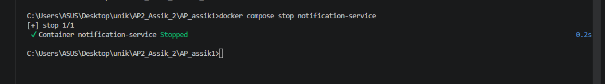
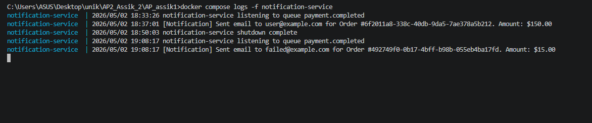
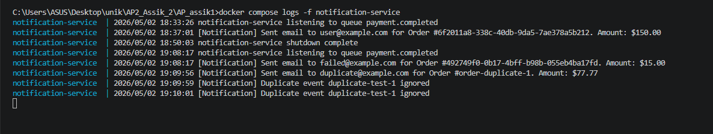
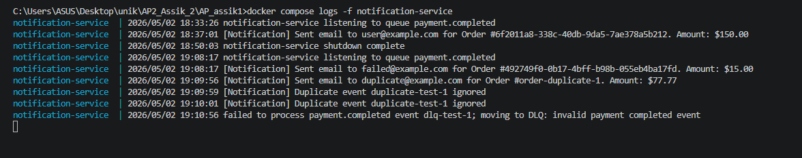
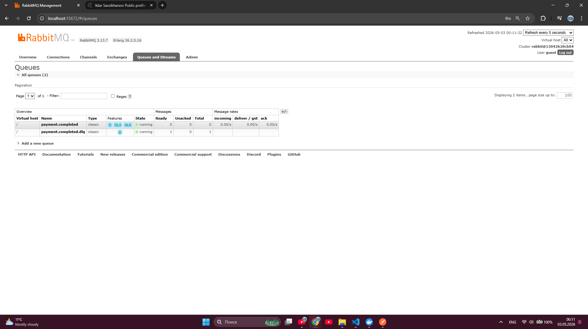

# AP2 Assignment 3 - Event-Driven Order, Payment, and Notification Services

## Overview

This project implements three Go microservices:

- `order-service`
- `payment-service`
- `notification-service`

The client still starts the flow through `order-service`. `order-service` calls `payment-service` synchronously through gRPC. After a successful payment is stored in the payment database, `payment-service` publishes a `payment.completed` event to RabbitMQ. `notification-service` consumes that event asynchronously and simulates sending an email by writing a log line.

## Event Flow



The same diagram is also available in `docs/assignment3_architecture.mmd`.

## Service Responsibilities

### Order Service

- accepts external HTTP requests
- creates orders with status `Pending`
- calls `payment-service` through gRPC
- updates order status to `Paid`, `Failed`, or keeps `Pending` if payment is unavailable
- stores `customer_email` so it can be passed to the payment event

HTTP endpoints:

- `POST /orders`
- `GET /orders/{id}`
- `GET /orders?customer_id={id}`
- `PATCH /orders/{id}/cancel`

### Payment Service

- processes payment requests
- stores payments in its own database
- publishes `payment.completed` after an authorized payment is committed
- uses RabbitMQ publisher confirms to make sure the broker accepted the event

HTTP endpoints:

- `POST /payments`
- `GET /payments/{order_id}`

gRPC port:

- `50051`

### Notification Service

- consumes RabbitMQ queue `payment.completed`
- does not call Order or Payment directly
- logs simulated email sending:

```text
[Notification] Sent email to user@example.com for Order #123. Amount: $99.99
```

## RabbitMQ Reliability

The queue `payment.completed` is durable, and published events use persistent delivery mode. This means RabbitMQ keeps the queue and messages across broker restarts.

`notification-service` uses manual ACK:

- auto-ack is disabled
- the message is ACKed only after the notification log is printed
- if processing fails, the message is NACKed with `requeue=false`
- failed messages are routed to `payment.completed.dlq`

## Idempotency Strategy

Each event has a unique `event_id`. `notification-service` keeps an in-memory set of processed event IDs.

- If `event_id` is new, it prints the notification log, stores the ID, then ACKs.
- If `event_id` was already processed, it skips the email log and ACKs the duplicate.

This prevents duplicate notifications when RabbitMQ redelivers a message.

## Graceful Shutdown

The services listen for `SIGINT` and `SIGTERM`.

- HTTP servers call `Shutdown`.
- gRPC servers call `GracefulStop`.
- RabbitMQ channels and connections are closed.
- Database pools are closed by deferred cleanup.

## Running Everything

Start the complete environment:

```bash
cd AP_assik1
docker compose up --build
```

Services:

- order-service HTTP: `http://localhost:8080`
- payment-service HTTP: `http://localhost:8081`
- payment-service gRPC: `localhost:50051`
- order-service gRPC: `localhost:50052`
- RabbitMQ AMQP: `localhost:5672`
- RabbitMQ UI: `http://localhost:15672`

RabbitMQ UI credentials:

```text
guest / guest
```

## API Examples

Create an order:

```bash
curl -X POST http://localhost:8080/orders \
  -H "Content-Type: application/json" \
  -d '{"customer_id":"cust-1","customer_email":"user@example.com","item_name":"Laptop","amount":15000}'
```

Expected result:

- `order-service` returns an order with status `Paid`
- `payment-service` stores the payment
- `payment-service` publishes `payment.completed`
- `notification-service` logs the simulated email

Get an order:

```bash
curl http://localhost:8080/orders/{id}
```

Get orders by customer:

```bash
curl "http://localhost:8080/orders?customer_id=cust-1"
```

Cancel a pending order:

```bash
curl -X PATCH http://localhost:8080/orders/{id}/cancel
```

Call payment-service directly:

```bash
curl -X POST http://localhost:8081/payments \
  -H "Content-Type: application/json" \
  -d '{"order_id":"order-1","customer_email":"user@example.com","amount":15000}'
```

## Protobuf Generation

The protobuf contracts are stored in:

- `../ap_protos/proto/order.proto`
- `../ap_protos/proto/payment.proto`

Generated Go code is stored in:

- `../ap-pb/order`
- `../ap-pb/payment`

On Windows, regenerate with:

```powershell
cd ..\ap_protos
.\protoc-temp\bin\protoc.exe -I proto -I protoc-temp\include --go_out=..\ap-pb\payment --go_opt=paths=source_relative --go-grpc_out=..\ap-pb\payment --go-grpc_opt=paths=source_relative payment.proto
.\protoc-temp\bin\protoc.exe -I proto -I protoc-temp\include --go_out=..\ap-pb\order --go_opt=paths=source_relative --go-grpc_out=..\ap-pb\order --go-grpc_opt=paths=source_relative order.proto
```

Do not manually edit generated `.pb.go` files.

## Project Structure

```text
AP_assik1/
├── order-service/
├── payment-service/
├── notification-service/
├── docker-compose.yml
└── docs/

ap_protos/
└── proto/

ap-pb/
├── order/
└── payment/
```

## Evidence

### RabbitMQ overview

Shows RabbitMQ running with service connections, queues, and a notification consumer.



### RabbitMQ queues

Shows the durable `payment.completed` queue and `payment.completed.dlq`.



### Notification consumer logs

Shows `notification-service` listening to `payment.completed` and processing a payment event.



### Durable queue test

Shows a message waiting in RabbitMQ while `notification-service` is stopped.



### Consumer stopped

Shows `notification-service` being stopped before the durable queue test.



### Durable message delivered after restart

Shows `notification-service` processing the queued message after it is started again.



### Idempotency duplicate handling

Shows that the first event is processed once and duplicate deliveries with the same `event_id` are ignored.



### DLQ processing error

Shows an invalid `payment.completed` event being rejected and moved to the dead-letter queue.



### DLQ message ready

Shows the failed message waiting in `payment.completed.dlq`.



## Completed Assignment 3 Requirements

- RabbitMQ message broker
- `payment-service` producer
- `notification-service` consumer
- durable queue
- persistent messages
- manual ACK
- idempotent consumer
- graceful shutdown
- Docker Compose orchestration
- architecture diagram
- README documentation
