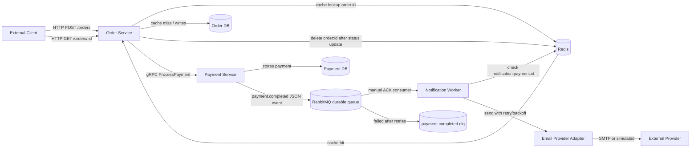
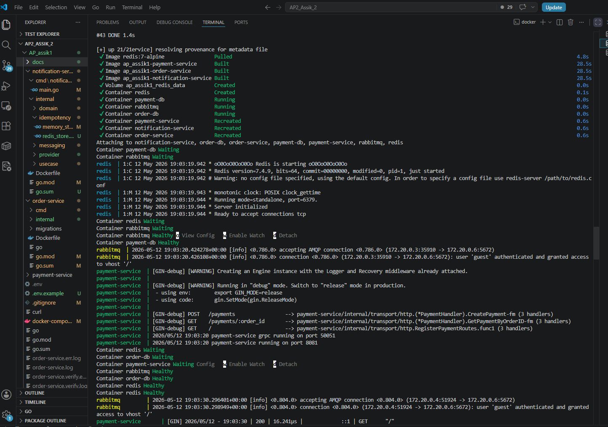
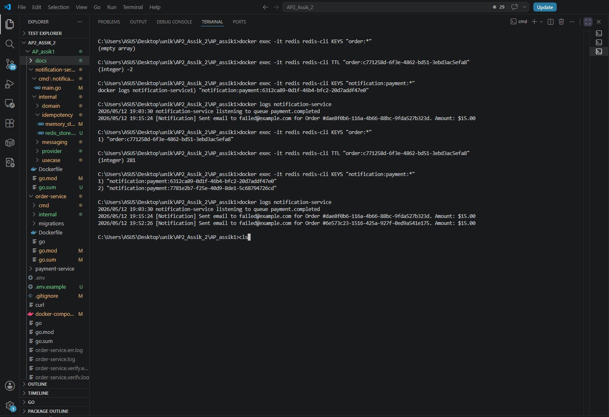

# AP2 Assignment 4 - Caching and Background Jobs

## Overview

This project contains three Go microservices:

- `order-service`
- `payment-service`
- `notification-service`

Assignment 4 extends the previous RabbitMQ-based flow with Redis caching, Redis-backed idempotency, provider adapters, and retryable notification jobs.

## Repository

GitHub: https://github.com/1B0-d/services

## Architecture


```mermaid
flowchart LR
    Client[External Client] -->|HTTP POST /orders| Order[Order Service]
    Client -->|HTTP GET /orders/:id| Order
    Order -->|cache lookup order:id| Redis[(Redis)]
    Redis -->|cache hit| Order
    Order -->|cache miss / writes| OrderDB[(Order DB)]
    Order -->|delete order:id after status update| Redis
    Order -->|gRPC ProcessPayment| Payment[Payment Service]
    Payment -->|stores payment| PaymentDB[(Payment DB)]
    Payment -->|payment.completed JSON event| RabbitMQ[(RabbitMQ durable queue)]
    RabbitMQ -->|manual ACK consumer| Worker[Notification Worker]
    Worker -->|check notification:payment:id| Redis
    Worker -->|send with retry/backoff| Provider[Email Provider Adapter]
    Provider -->|SMTP or simulated| External[External Provider]
    RabbitMQ -->|failed after retries| DLQ[(payment.completed.dlq)]
```

The same diagram is available in `docs/assignment4_architecture.mmd`.

## Order Service

HTTP endpoints:

- `POST /orders`
- `GET /orders/{id}`
- `GET /orders?customer_id={id}`
- `PATCH /orders/{id}/cancel`

`GET /orders/{id}` uses the cache-aside pattern:

1. Check Redis key `order:{id}`.
2. On cache hit, return the cached order.
3. On cache miss, read from PostgreSQL and store the order in Redis with `ORDER_CACHE_TTL`.

Cache invalidation happens immediately after successful database status updates. When an order becomes `Paid`, `Failed`, or `Cancelled`, `order-service` deletes `order:{id}` from Redis so the next read cannot serve stale status.

Bonus rate limiting is also implemented with Redis. When `ORDER_RATE_LIMIT_ENABLED=true`, requests are limited by client IP using `rate_limit:{ip}` keys. Exceeded requests return `HTTP 429`.

## Payment Service

`payment-service` still owns payment persistence and publishes a durable `payment.completed` event to RabbitMQ after an authorized payment is committed.

HTTP endpoints:

- `POST /payments`
- `GET /payments/{order_id}`

gRPC port:

- `50051`

## Notification Service

`notification-service` is a background worker. It consumes `payment.completed` messages from RabbitMQ and acknowledges a message only after the notification is handled.

The worker uses an adapter interface:

```go
type NotificationProvider interface {
    SendPaymentCompleted(ctx context.Context, event PaymentCompletedEvent) error
}
```

Provider mode is configured by `PROVIDER_MODE`:

- `SIMULATED`: sleeps for `SIMULATED_PROVIDER_LATENCY` and randomly fails using `SIMULATED_PROVIDER_FAILURE_RATE`.
- `SMTP` or `REAL`: sends email through SMTP using `SMTP_*` variables.

## Retries and Idempotency

Notification idempotency is stored in Redis by payment ID:

```text
notification:payment:{payment_id} -> sent
```

Before sending, the worker checks this key. If it already exists with status `sent`, the duplicate job is acknowledged and skipped.

Provider failures are retried with exponential backoff. With the default settings, the worker makes 4 attempts with retry delays:

```text
2s, 4s, 8s
```

If all attempts fail, the RabbitMQ message is rejected and routed to `payment.completed.dlq`.

## Configuration

Copy `.env.example` to `.env` and adjust values if needed:

```bash
cp .env.example .env
```

Important variables:

- `REDIS_ADDR`
- `ORDER_CACHE_TTL`
- `ORDER_RATE_LIMIT_ENABLED`
- `ORDER_RATE_LIMIT_REQUESTS`
- `ORDER_RATE_LIMIT_WINDOW`
- `NOTIFICATION_IDEMPOTENCY_TTL`
- `NOTIFICATION_RETRY_COUNT`
- `NOTIFICATION_RETRY_BASE_DELAY`
- `PROVIDER_MODE`
- `SIMULATED_PROVIDER_LATENCY`
- `SIMULATED_PROVIDER_FAILURE_RATE`
- `SMTP_HOST`, `SMTP_PORT`, `SMTP_USERNAME`, `SMTP_PASSWORD`, `SMTP_FROM`

## Running Everything

Start the complete environment:

```bash
docker compose up --build
```

Services:

- order-service HTTP: `http://localhost:8080`
- payment-service HTTP: `http://localhost:8081`
- payment-service gRPC: `localhost:50051`
- order-service gRPC: `localhost:50052`
- RabbitMQ AMQP: `localhost:5672`
- RabbitMQ UI: `http://localhost:15672`
- Redis: `localhost:6379`

RabbitMQ UI credentials:

```text
guest / guest
```

## API Examples

Create an order:

```bash
curl -X POST http://localhost:8080/orders \
  -H "Content-Type: application/json" \
  -d '{"customer_id":"cust-1","customer_email":"user@example.com","item_name":"Laptop","amount":15000}'
```

Get an order:

```bash
curl http://localhost:8080/orders/{id}
```

Get orders by customer:

```bash
curl "http://localhost:8080/orders?customer_id=cust-1"
```

Cancel a pending order:

```bash
curl -X PATCH http://localhost:8080/orders/{id}/cancel
```

Call payment-service directly:

```bash
curl -X POST http://localhost:8081/payments \
  -H "Content-Type: application/json" \
  -d '{"order_id":"order-1","customer_email":"user@example.com","amount":15000}'
```

## Evidence Screenshots

Docker Compose starts Redis, RabbitMQ, PostgreSQL, and all three services:



Redis contains order cache keys with TTL and notification idempotency keys. The worker logs also show successful background notification processing:



## Completed Assignment 4 Requirements

- Redis cache-aside for `GET /orders/{id}`
- TTL-based order cache entries
- cache invalidation after order status changes
- Redis-backed notification idempotency by `payment_id`
- provider adapter pattern for simulated and SMTP email providers
- retryable notification worker with exponential backoff
- Redis-backed API rate limiter bonus
- Docker Compose orchestration with Redis, RabbitMQ, PostgreSQL, and all services
- updated architecture diagram and documentation
